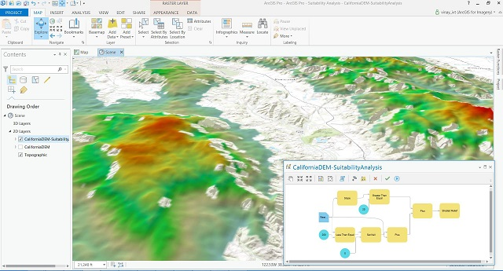
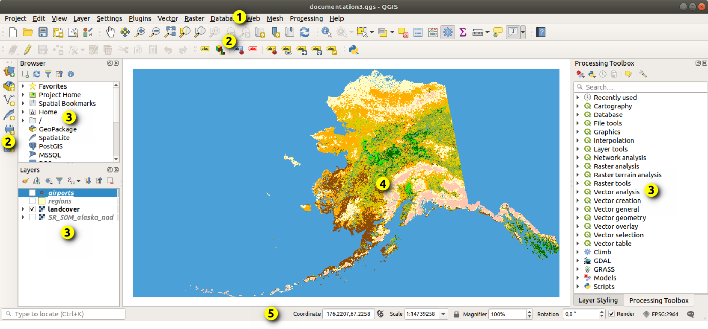
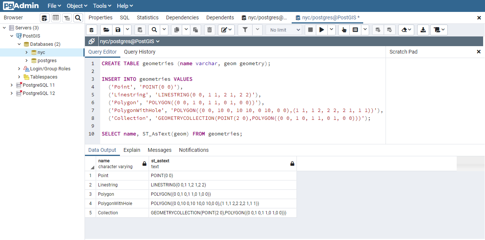
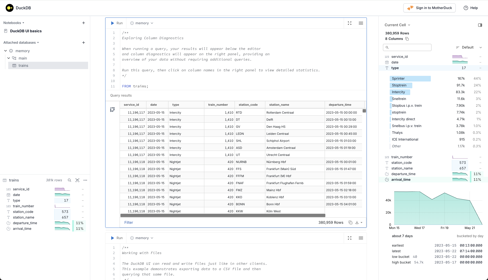
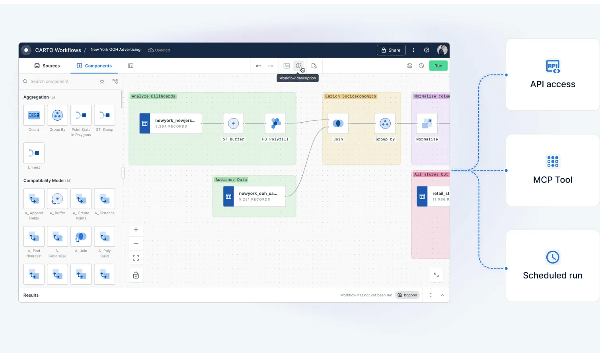

+++
date        = '2026-05-30T09:39:12+07:00'
draft       = true
title       = 'Modern 2026 Geospatial Analytics Stack: Which to Use?'
tags        = ['geospatial', 'spatial data science', 'urban analytics', 'GIS']
description = 'A spatial data scientist guide on which tool to choose to analyse geospatial data'
Summary     = 'A spatial data scientist guide on which tool to choose to analyse geospatial data'
featured_image = 'SEA.png'
+++

# Executive Summary

This article reviews six geospatial analytics tools across two categories: the classic stacks and the modern stacks. Each tool is assessed on its strengths, weaknesses, and the scenarios where it is the right choice. The core argument is that these tools are complementary, not competing: the right stack depends on your scale, budget, team skills, and where your data lives.

**Classic Stacks**

- **ArcGIS Pro**: The enterprise standard. Best when your organisation is already in the ESRI ecosystem, requires vendor support, and needs to publish maps through ArcGIS Online. Windows only, and expensive.
- **QGIS**: The open-source workhorse. Best for desktop GIS work across any operating system, without licensing costs or vendor lock-in. Integrates well with GDAL and PostGIS.
- **PostGIS**: The spatial database backbone. Best when you need a centralised, multi-user spatial database to power web applications or enterprise GIS platforms. Requires SQL proficiency and server administration.

**Modern Stacks**

- **DuckDB**: The fast local analyst. Best for solo data science workflows, rapid prototyping, and querying spatial files directly (Parquet, GeoJSON, CSV) without any server setup.
- **Apache Sedona**: The big data engine. Best when your dataset reaches a scale that a single machine cannot handle: billions of rows, distributed cluster infrastructure, and both vector and raster workloads in one framework.
- **CARTO**: The cloud-native platform. Best when your data already lives in a cloud data warehouse (BigQuery, Snowflake, Redshift) and you need spatial analytics accessible to non-GIS experts, with managed infrastructure and no data movement.

No single tool wins across all scenarios, but knowing what each does well allows you to compose them into a robust spatial analytics pipeline.

---

# Introduction

The geospatial analytics world has come to a more inclusive and powerful state. In the 1990s, there were only limited proprietary software products to choose from to solve GIS problems. Nowadays, open-source software has prevailed taking on paid software as worthy and robust alternatives; most notably, QGIS. "Alternative" is an understatement; it is one of the main options. 

The progress towards inclusivity has not stopped; it gets better and it is impressive. I have been in the GIS world for almost 10 years now and things have changed for good. In 2026, I decided to catch up with the latest tools to see what we have for spatial data scientists. Some tools I have played around with have impressed me. It got me thinking: "I am left out and I need to adopt these new tools".

I would like to share some of the tools I have played around with, with some thoughts.

# The Classic Stacks

The classic stacks are software stacks that have proved themselves for years. I'd like to mention these tools:

- ArcGIS Pro
- QGIS
- Postgresql with Postgis

## ArcGIS Pro

When to use?
- Your organisation runs an existing ESRI ecosystem and needs seamless integration across products.
- You need enterprise support, guaranteed uptime, and vendor-backed training for mission-critical GIS work.
- Publishing interactive maps to ArcGIS Online for internal or public consumption is a core requirement.

ArcGIS Pro is a professional desktop geographic information system application developed by Esri. It allows users to visualise, analyse, manage, and share geographic data in both two and three dimensions. Designed with a modern ribbon interface, the software integrates advanced mapping tools and spatial analysis features to help organisations make data-driven decisions. It also connects seamlessly with cloud platforms to facilitate collaboration and the sharing of spatial insights across teams.

> Special Features:
> - Enterprise support with decades of experience
> - ArcGIS Online; integrates with online map
> - ESRI software integration
> - Can publish maps online
> - Windows only

| Strength | Weakness |
|----------|------------|
|   Robust enterprise support       |        Expensive    |
|   Complete tools       | Certain analysis tools require licensing |
|   Collaborative working in centralise database; integrates with arcgis online      | Dependence on marked-up credit to operate server |
| Can publish map online | |

## QGIS

When to use?
- You need a full-featured desktop GIS without licensing costs or vendor lock-in.
- Your team works across multiple operating systems, including Linux and macOS.
- You want tight integration with open-source tools such as GDAL and PostGIS, or need community plugins for specialised workflows.

QGIS is a free and open-source desktop geographic information system application that provides data viewing, editing, and analysis capabilities. It operates across multiple operating systems and supports numerous vector, raster, and database formats through its flexible plugin architecture. Because it is community-driven, the software offers a cost-effective and highly customisable alternative for individuals and organisations looking to perform complex spatial analysis and create professional maps without licensing constraints.

> Special Features:
> - Free and open-source
> - Can do what ArcGIS Pro mostly does
> - Multi-OS
> - Windows only

| Strength | Weakness |
|----------|------------|
| C++ written; app is super fast | GUI feels old |
| Free | No enterprise support |
| All tools are available, no paywall, no vendor lock in | No online server to publish maps; requires independent setup |
| Community plugin ecosystem | Collaborative work on a centralised database requires independent setup |
| Integrates seamlessly with open-source tools such as GDAL/Postgis ||

## Postgis

When to use?
- You need a spatial database backend for web applications or GIS platforms with concurrent multi-user access.
- Your analysis demands complex SQL-native spatial queries on large, structured datasets stored centrally.
- You are already running PostgreSQL and want to extend it with robust geographic capabilities without additional infrastructure.

PostGIS is an open-source software program that adds support for geographic objects to the PostgreSQL object-relational database. It extends the database's capabilities, allowing it to store and query spatial data such as points, lines, and polygons. With its robust support for spatial indexing and advanced SQL functions, users can run complex geographic queries and analysis directly within the database. This makes it a crucial backend component for powering large-scale web mapping applications and enterprise geographic information systems.

> Special Features:
> - Free and open-source
> - Operated with SQL
> - Lives in a server
> - A database

| Strength | Weakness |
|----------|------------|
| Highly efficient spatial indexing and SQL-native analysis for massive datasets | Lacks a native graphical user interface for visual mapping, requiring external software like QGIS |
| Free and open-source with no licensing costs or vendor lock-in | High learning curve, requiring strong proficiency in SQL and database administration |
| Exceptional multi-user editing and enterprise-grade concurrent data handling | Requires independent server setup, maintenance, and backup infrastructure |
| Seamlessly integrates with major GIS software, web frameworks, and libraries | Complex spatial queries can cause server performance bottlenecks if indexes are not properly configured |
| Fully standards-compliant, supporting a vast array of geographic formats and functions ||

# Modern Stacks

It's 2026 and some spatial analytic tools have emerged and rised to prominence. I would like to discuss these tools:

- DuckDB
- Apache Sedona
- Carto

## DuckDB

When to use?
- You are doing local spatial analysis or rapid prototyping and want zero server setup overhead.
- Your workflow involves querying files directly: Parquet, GeoJSON, or CSV, without a formal import step.
- You are working within a Python or R data science environment and need fast, SQL-native spatial analytics on a single machine.

DuckDB is an open-source, embedded analytical database management system designed to execute complex queries with exceptional speed. It extends traditional relational database capabilities by providing native support for spatial data through its spatial extension, allowing users to efficiently query and process geographic objects like points, lines, and polygons. Because it operates in-process without the overhead of a separate server, it is highly optimised for local data analysis, data science workflows, and fast prototyping. This makes it an invaluable tool for developers and analysts who need to perform rapid spatial analytics on large datasets directly within their local applications.

> Special Features:
> - Free and open-source
> - Operated with SQL
> - Lives in-process (no server required)
> - A database

| Strength | Weakness |
|----------|------------|
| Blazing fast columnar vectorised execution engine for analytical and spatial queries | Not designed for high-concurrency multi-user editing or transactional database workloads |
| Zero-configuration embedded deployment with no server setup or maintenance required | Lacks a native graphical user interface for visual mapping, requiring external tools for rendering |
| Seamless integration with Python, R, and modern data science ecosystems | Entirely reliant on local machine resources (CPU/RAM) for processing heavy workloads |
| Ability to directly query external files (Parquet, CSV, GeoJSON) without a formal import process | Spatial ecosystem is newer and less mature than deeply established tools like PostGIS |
| Highly portable single-file database architecture that is easy to share and distribute ||

## Apache Sedona

When to use?
- Your dataset is at a scale where PostGIS or DuckDB can no longer keep up: billions of rows, continental or global coverage.
- You are building enterprise spatial data pipelines on distributed cluster infrastructure such as Apache Spark or a cloud lakehouse.
- Your workload involves both large vector datasets and satellite or raster imagery that must be processed in a single, unified framework.

Apache Sedona is an open-source, distributed computing system designed to process and analyse large-scale spatial data across cluster environments. It extends cluster-computing frameworks like Apache Spark and Apache Flink, adding specialised spatial data types, spatial indexing, and optimised geometric operations to efficiently handle massive vector and raster datasets. By utilising spatial-aware data partitioning, it minimises network shuffling across cluster nodes, allowing for rapid geographic joins and analytics on billions of rows. This makes it an essential engine for large-scale enterprise data pipelines, spatial lakehouses, and cloud-native big data infrastructures.

> Special Features:
> - Free and open-source
> - Operated with SQL, Python, R, and Scala/Java
> - Lives in a distributed cluster ecosystem (or locally via SedonaDB)
> - A cluster computing framework and engine

| Strength | Weakness |
|----------|------------|
| Incredible scalability, handling billions of rows using distributed spatial joins and partitioning | High infrastructure complexity, requiring a distributed cluster (like Spark or Flink) to unlock full potential |
| Native dual-support for both complex vector geometries and large-scale raster datasets (e.g. satellite imagery) | Steep learning curve, demanding knowledge of both big data architecture and spatial data engineering |
| Minimises network overhead by grouping geographically close data onto the same processing nodes | Overkill for small to medium datasets where traditional databases like PostGIS perform faster with less overhead |
| Seamlessly integrates with modern cloud-native data lakehouses (e.g. Apache Iceberg and Delta Lake) | Lacks a built-in user interface, requiring external integration with visualisation libraries or GIS software |
| Exceptional multi-language API support across Python, SQL, Java, Scala, and R ||

## Carto

When to use?
- Your enterprise data already lives in a cloud data warehouse such as BigQuery, Snowflake, or Redshift, and you want spatial analytics without moving it.
- Your team includes non-GIS experts who need accessible, low-code tools to build maps and run location intelligence workflows.
- You need to rapidly deploy production-ready web maps or dashboards and have the budget for a managed SaaS platform.

CARTO is a cloud-native location intelligence and spatial analytics platform designed to build, visualise, and analyse geographic data at an enterprise scale. Moving away from traditional GIS architectures, it operates as a commercial, fully managed software-as-a-service (SaaS) that connects directly to modern cloud data warehouses and lakehouses, such as Snowflake, Google BigQuery, Databricks, and Amazon Redshift. By pushing all spatial computations directly to the data tier via pushdown SQL, it eliminates the need to extract or move massive datasets. The platform combines low-code visual workflow builders with powerful developer toolkits and AI-driven geographic models, making it an essential tool for organisations looking to operationalise business data and uncover spatial insights directly within their centralised cloud infrastructure.

> Special Features:
> - Commercial enterprise SaaS model (Proprietary platform)
> - Operated with SQL, drag-and-drop workflows, and AI agents
> - Lives in the cloud (fully integrated with cloud data warehouses)
> - A location intelligence and cloud-native spatial analytics platform

| Strength | Weakness |
|----------|------------|
| True cloud-native architecture that processes billions of data points directly within data warehouses without extraction | Substantial operational costs, as usage-based pricing models can become highly expensive for heavy workflows |
| User-friendly, low-code tools like CARTO Workflows and Builder that make spatial analytics accessible to non-GIS experts | Entirely dependent on an active internet connection and cloud infrastructure, making it unsuitable for offline use |
| Rapid deployment of production-ready web maps and custom data dashboards using framework-agnostic developer tools | Not built for deep, desktop-style cartography or advanced manual geometry editing compared to QGIS or ArcGIS Pro |
| Fully integrated with modern AI frameworks, MCP servers, and autonomous agents for natural-language spatial queries | Heavy reliance on the host data warehouse's underlying spatial processing capabilities and limitations |
| Eliminates data silos and complex ETL pipelines by keeping enterprise data centralised and secure within the cloud ||

# Closing

The geospatial toolkit in 2026 is broader and more capable than it has ever been, which makes the question of "which tool?" more important than ever. There is no single right answer: the right stack depends on your data scale, your team's technical depth, your budget, and where your data lives.

For most desktop GIS work, QGIS remains the default choice, free, fast, and capable. ArcGIS Pro earns its place in organisations that are already embedded in the ESRI ecosystem or require guaranteed enterprise support. PostGIS is still the backbone of any serious spatial web application or multi-user editing environment. For local data science workflows and ad-hoc analysis, DuckDB has become genuinely hard to ignore. When your data grows to a scale that a single machine cannot handle, Apache Sedona is the natural step up. And if your organisation's data already lives in a cloud data warehouse and you need spatial analytics accessible to a wider team, CARTO makes a compelling case.

The best approach is not to pick one and ignore the rest. These tools are largely complementary. A robust spatial data pipeline might ingest with PostGIS, analyse at scale with Sedona, prototype quickly with DuckDB, and surface results through QGIS or CARTO. Understanding what each tool does well, and where it falls short, is what allows you to compose them effectively.

The barrier to entry for powerful spatial analytics has never been lower. The only real mistake is using the wrong tool for the job.

