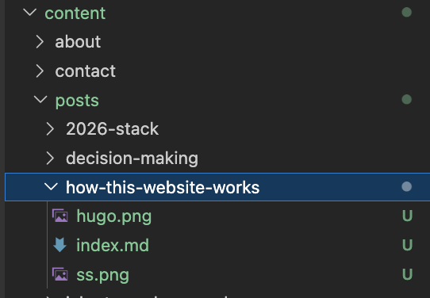

+++
date        = '2026-05-30T20:35:01+07:00'
draft       = false
title       = 'How This Website Works'
tags        = ['hugo', 'static site', 'github actions', 'web development']
description = 'A look under the hood of sutan.co.uk: how Hugo turns Markdown into a static site and how GitHub Actions deploys it automatically.'
Summary     = 'A look under the hood of sutan.co.uk: how Hugo turns Markdown into a static site and how GitHub Actions deploys it automatically.'
featured_image = 'ss.png'
+++

I am quite happy with how this website is built, so I thought I would share how it works. There is no database, no content management system, and no server running application code. The whole site is a folder of plain text files that gets turned into static HTML and served directly. This post walks through three things: what Hugo is, how I write content in Markdown, and how GitHub deploys the site automatically every time I push a change.

The full source code is public, so you can follow along or fork it for yourself: [github.com/sutanmufti/personal-site-3](https://github.com/sutanmufti/personal-site-3).

## What Is Hugo?

[Hugo](https://gohugo.io/) is a static site generator. That phrase deserves unpacking.

[](https://gohugo.io/)

A traditional website, say one built with WordPress, generates each page on demand. When a visitor requests a page, the server runs code, queries a database, assembles the HTML, and sends it back. This happens on every single request. It is flexible, but it is also slow, resource-hungry, and a large surface for security problems.

A static site generator works the opposite way. It does all the assembly work once, ahead of time, on my machine or on a build server. The output is a set of plain HTML, CSS, and JavaScript files. When a visitor arrives, the server simply hands over a file that already exists. Nothing is computed at request time. The result is fast, cheap to host, and very hard to attack because there is no live database or application logic to exploit.

Hugo specifically is written in Go, which makes it remarkably fast: it builds this entire site in well under a second. It takes my content and my templates, combines them, and writes the finished website into a folder called `public`.

## The Markdown Content

All the writing on this site lives as [Markdown](https://www.markdownguide.org/) files inside the `content` directory. Markdown is a lightweight way of writing formatted text using plain characters. A hash makes a heading, asterisks make text bold, and square brackets with parentheses make a link. It stays readable as plain text, and Hugo converts it into proper HTML at build time.

Each post is a folder containing an `index.md` file. The post you are reading right now lives at:

```
content/posts/how-this-website-works/index.md
```



Keeping each post in its own folder is called a page bundle. It means I can drop images alongside the text and reference them with a simple relative path, rather than managing a separate assets folder.

Every Markdown file starts with a block of metadata called front matter, wrapped in `+++`:

```toml
+++
date        = '2026-05-30T20:35:01+07:00'
draft       = false
title       = 'How This Website Works'
tags        = ['hugo', 'static site']
description = 'A look under the hood of sutan.co.uk.'
+++
```

This tells Hugo the title, the publish date, the tags, and the description used for search engines and social media previews. The `draft` flag is useful: while it is set to `true`, the post is invisible on the live site, so I can work on a piece privately until it is ready.

When Hugo builds the site, it takes each Markdown file, reads its front matter, runs the body through its Markdown processor, and slots the result into an HTML template that provides the navigation, footer, and styling. The templates live in the `layouts` directory and define the consistent look across every page.

## How GitHub Deploys It Automatically

Writing and building locally is one thing. Getting the site onto the internet is another. This is handled entirely by GitHub, with no manual steps from me.

The site's code lives in a GitHub repository. Whenever I finish a change, I commit it and push to the `main` branch. That push triggers a GitHub Actions workflow, which is a set of instructions stored in the repository at `.github/workflows/deploy.yml`. GitHub reads that file and runs the steps on a fresh virtual machine in the cloud.

Here is what the workflow does, step by step:

```yaml
on:
  push:
    branches:
      - main
```

This is the trigger. The workflow runs on every push to `main`, and nothing else sets it off.

The build job then does the following:

1. **Checkout**: it downloads a copy of the repository onto the build machine.
2. **Setup Node**: it installs Node.js, which is needed for the CSS tooling (Tailwind runs through PostCSS).
3. **Install dependencies**: it runs `npm ci` to install the exact packages listed in the lockfile.
4. **Setup Hugo**: it installs the extended version of Hugo, pinned to the same version I use locally so the build is reproducible.
5. **Build**: it runs `hugo --minify`, which generates the whole site into the `public` folder and strips out unnecessary whitespace to keep file sizes small.
6. **Upload artifact**: it packages the `public` folder and hands it to GitHub Pages.

A second job then takes that built artifact and deploys it to [GitHub Pages](https://pages.github.com/), which is GitHub's free static hosting service. Within a minute or two of my pushing a change, the live site at sutan.co.uk reflects it.

The workflow also includes a small but useful detail:

```yaml
concurrency:
  group: pages
  cancel-in-progress: true
```

If I push twice in quick succession, this cancels the older build and only ships the latest one. There is no risk of two deployments racing each other.

## Putting It Together

The whole pipeline is straightforward once you see the shape of it:

1. I write a post as a Markdown file in the `content` folder.
2. I commit and push it to GitHub.
3. GitHub Actions spins up a machine, installs Hugo, and builds the site.
4. The built files are deployed to GitHub Pages and served to visitors.

There is no database to back up, no server to patch, and no hosting bill beyond nothing, since GitHub Pages is free for this. The entire site is version-controlled, so every change is tracked and any mistake can be reverted. For a personal site that is mostly writing and a handful of project pages, it is hard to beat.

If you are curious, the full source code for this website is public on [GitHub](https://github.com/sutanmufti/personal-site-3).
