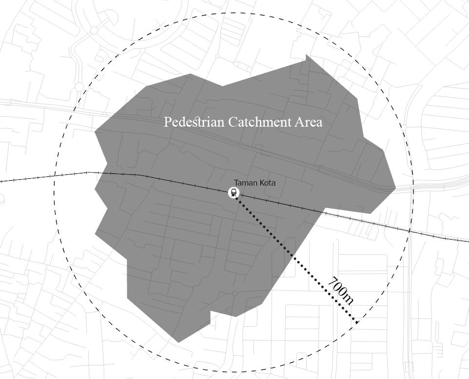
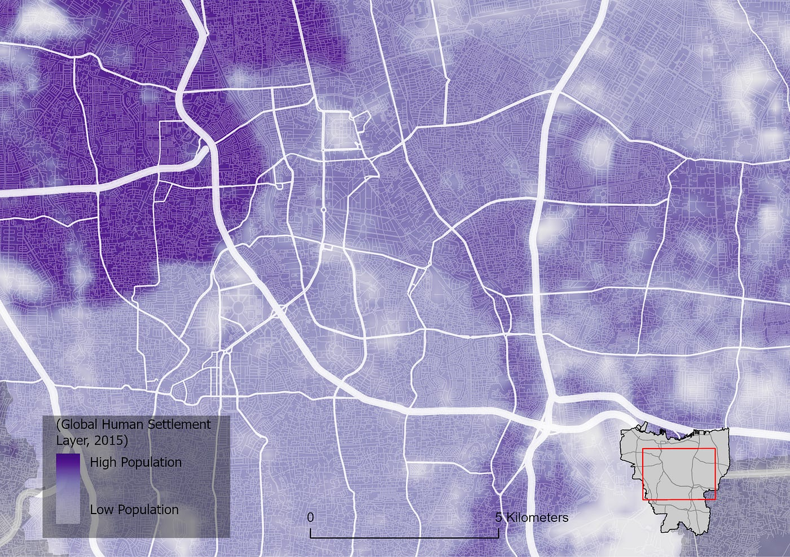
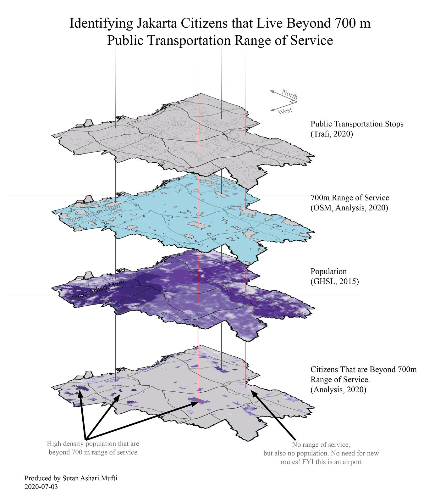

+++
date        = '2020-07-04T17:18:24+07:00'
draft       = false
title       = 'Public Transportation Range of Service: Identifying Underserved Citizens in Jakarta, Indonesia'
tags        = ['GIS', 'Jakarta', 'Urban Planning', 'Public Transportation', 'Spatial Analysis', 'Indonesia']
description = 'Using GIS and network analysis to identify which Jakarta residents fall outside the 700m walking distance to public transportation, and what this means for urban planning.'
Summary     = 'Around 827,594 Jakarta citizens live beyond the 700m walking threshold to public transportation. This article uses GIS and road network analysis to map the unserved population and argues for integrated transportation and spatial planning.'
featured_image = '1_hT1ZPgVHWkCNxGc1NSBVOw.jpg'
+++

*Article was published first on [Towards Data Science in 2020](https://medium.com/data-science/public-transportation-range-of-service-identifying-the-unserved-citizens-in-jakarta-city-eaf8f3446fce)*.

*With limited stamina, people are only able to walk to some duration or distance. To promote public transportation usage, the accessibility of public transportation service should be within this distance. Using Geographical Information System, we are able to identify which regions are not within the walking distance and infer the unserved citizens.*

> **Summary:** Jakarta City is among the worst congested cities in the world. Public transportation usage must be promoted by first widening the service coverage to the residents. This covering distance should be within 700 m based on the standard walking distance as humans have limited stamina to walk. So,
>
> **has Jakarta's 700 m public transportation range of service reached all of its residents?**
>
> The answer is no. There are around (approximated) [827,594](https://jakarta.bps.go.id/dynamictable/2019/09/16/58/3-1-2-jumlah-penduduk-provinsi-dki-jakarta-menurut-kelompok-umur-dan-jenis-kelamin-2018-2019.html) (out of 10 million) **citizens** that live **beyond** current public transportation walking distance. **9160.16** out of 64,752 hectares (around 14%) are **not covered** by the service range. To reduce the number, there is a need to plan new routes and produce a spatial plan that either incorporates the route, OR is incorporated by the new route.

## Introduction

[Jakarta is among the worst](https://en.tempo.co/read/1303052/jakarta-ranks-10th-on-worlds-most-congested-cities-list) if we are talking about congestion; it lingers in the top 10 most congested cities in the world. Time lost due to congestion may take up to more than 19 minutes in the morning and 26 minutes in the evening. As a result, each year, 7 days and 6 hours are spent by each Jakarta citizen on traffic congestion ([Tomtom, 2019](https://www.tomtom.com/en_gb/traffic-index/jakarta-traffic/)). Moreover, the congestion results in a surge in [air pollution](https://www.thejakartapost.com/academia/2019/09/14/jakarta-needs-tough-air-pollution-control-are-we-ready.html) that is, needless to say, slowly intoxicating its citizens. Despite various metrics and rankings by many institutions, it does not diminish the urgency of the problem, and this problem still needs to be addressed.

Surely, something has to be done to reduce this usage: by shifting the private vehicle consumption to public transportation. This can be done by reducing the cost of public transportation, and by cost, I don't mean monetary value. The components of cost can include experience, amenity, feelings, convenience, ticket price, and many things that affect a person's decision to use public transportation (although the calculation using some statistical methods may convert these variables to a monetary unit). I suggest that **the most fundamental variable for people to use public transportation is transportation's range of service; the distance that a person should walk to access public transportation.**

*(Imagine: even with the nicest train or bus, beautiful pedestrian way; you would not walk 10 km just to use the service, would you?)*

Well, 10 km is just an exaggeration. The point is, the walking distance should be short. There are many justifications for this statement, but it's going to take a deep dive into some academic papers, lots of statistics will be involved, and I don't want this essay to get heavy. So, let's just keep it light (if you want to look for arguments, see [this](https://www.sciencedirect.com/science/article/pii/S0967070X11000631), and [this](https://ppms.trec.pdx.edu/media/project_files/schlossberg_GIS_audits_1.pdf)). Note, I don't ignore other causing variables. My argument is that before we fulfill other variables, the range of service should be prioritised.

With limited capacity to walk, the range of service must be within walking distance: that is, 700m. This number is set by Jakarta Provincial Regulation as a standard for designating Transit-Oriented Development (TOD) region. **Beyond this number, it is expected that people will use other means of transportation because it is too tiring to walk!** Thus, we have to make sure that every citizen in Jakarta is within this 700m threshold.

**This range is two-dimensional and results in an area that defines the transportation range of service.** In my [other article](https://medium.com/swlh/assessing-railway-stations-in-jakarta-based-on-neighbourhood-built-environment-f44f7d89c8bc), I use other nomenclature: Pedestrian Catchment Area (PCA), but it is essentially the same.

## The Objective

**This essay seeks to identify the number of citizens that are not within the 700m transportation range of service. To achieve that, some geographical data are used:**

- locations of every public transportation stop (transportation facilities)
- road geometry
- Population Distribution

Some analysis uses the 700 m distance as circular radius, but empirically, people don't fly. People walk and turn; roads have intersections and curves, so this 700 m walking distance is certainly within 700 m radius.

## The Data

This section explains the input data: transportation facilities, road geometry, and population distribution.

### Data #1: Transportation Facilities

There are many transportation providers in Jakarta both private and state-owned enterprises. Although the published list of current transportation services can be found in the [official open data website](https://data.jakarta.go.id/dataset/daftartrayekangkutanumum/resource/8532ecf6-733d-4238-91e9-75d1e097f561), [Trafi](https://web.trafi.com/id/jakarta) has collected and provided a comprehensive collection of the data, which I must credit. The dots are the facilities' stops; there, you can board the cars or buses.

). The Road geometry is collected from [OpenStreetMap](https://www.openstreetmap.org/)](1_H6Ws-JIC8sO30nyIxZTeDQ.jpg)

### Data #2: Road Geometry

Road geometry is retrieved from [OpenStreetMap (OSM)](https://www.openstreetmap.org/). Notice the dots on the map. **The dots are the public transportation stops retrieved from Trafi.** The road geometry encompasses all road hierarchies (motorway, primary, secondary, residential, pedestrian, etc.). Zooming in, we can see the complexity of Jakarta's road design.

 and [Trafi](http://web.trafi.com/id/jakarta), 2020)](1_1r2eXM18k2HJ-ojNVLas-g.jpg)

### Data #3: Population Distribution

I stumbled upon my [senior's article](https://medium.com/@luthfimuhamadiqbal/fixing-indonesian-urban-data-f824fab20f49) which discusses the degree of Indonesia's urbanisation (in terms of built-up regions and density) and regional urban system. One of the arguments is that in order to define and analyse a metropolitan area, we need population data in grids. I could not agree more, and fortunately, the [Global Human Settlement Layer](https://ghsl.jrc.ec.europa.eu/data.php#GHSLBasics), as the article mentioned, provides such data.

The continuous nature of raster data provides flexibility in analysis. It disregards the discrete nature of geographical data that is aggregated to administrative boundaries (such as data that can be visualised by [choropleth maps](https://en.wikipedia.org/wiki/Choropleth_map#:~:text=A%20choropleth%20map%20(from%20Greek,density%20or%20per%2Dcapita%20income.)). As a data analyst, this kind of continuous data, sparks joy! This article's analysis needs [continuous data, not discrete ordinal data](https://learn.g2.com/discrete-vs-continuous-data).

## The Analysis

For each transportation facility stop, I identified the pedestrian catchment area (PCA) as the range of service (PCA and range of service are interchangeable) and eliminated the regions that are already covered by the pedestrian catchment area. **This results in regions that are not covered by the pedestrian catchment but some regions are not meant to be covered by the PCA such as airports, empty fields, lakes.**

So, I extract by overlaying the population data with the regions that are not served by transportation facilities (regions beyond 700 m). This is why continuous population data is needed because extracting discrete geographical data (such as spatially extracting from the administrative boundary) does not make sense!

I guess it is easier for the readers to just look at the figure below.

## Conclusion

The result of the analysis is a raster that holds the value of citizens that are not covered by the current public transportation range of service. As the objective stated, this essay seeks to identify the number of unserved citizens.

Summing up all of the cells' values, **there are approximately 827,594 citizens that are not served**. Note that I use "approximately" this is because the population data's scale is too small, and needs to be reassessed based on the local context.

Furthermore, 9160.16 out of 64,752 hectares (around 14%) are not covered by the service. However, parts of the 14% are not supposed to be covered or do not need to be covered. These parts are regions that are not populated: lakes, an airport, empty fields, etc. So, there are always regions that are not served by transportation service and it is expected.

## Some Remarks and Recommendation

This section explains the recommendation and the importance of integrating transportation plan and urban/spatial plan.

### Transportation Urban Planning and Urban Design Integration

[Transportation and urban planning/design are inseparable](https://transportgeography.org/?page_id=4882). Land use affects transportation and transportation affects land use. Because of these interactions, the transportation plan must be integrated with the urban spatial plans; transportation plan cannot stand alone as transportation is defined and compiled by the built environment around them.

Counter-intuitively, we can say that, in order to improve our transportation, we can intervene in our urban environment, without intervening in transportation itself. For example:

- building better wider sidewalk reduces the demand of private vehicles resulting in a rise in public transportation demand
- building new pedestrian network improves the pedestrian catchment areas making the station serve more residents, increasing the traffic of the station
- mixing the land uses provides nearby services reducing the need to travel to another part of the city for service
- Reducing the city block size shortens the walking distance

### Recommendation

**Putting it into context;** what should we do to the current Jakarta citizens that live beyond the 700m transportation range of service?

**Obviously, plan new routes** that serve the unserved residents. But! **Make sure that the pedestrian network around the route incorporates the new route**, providing a direct line to the service or shorter distance. This can be done by producing new urban design plans for some prioritised regions.

Another quite radical idea is to reorganize the building mass to produce higher permeability. Consolidate the land and reorganize the space, moving the unserved citizens to the already served nearby neighbourhood. I feel like this one is less likely, but hey! [That's what the Japanese did!](http://documents1.worldbank.org/curated/en/481571569562840686/pdf/Land-Readjustment-in-Japan-Case-Study.pdf)

### The Institution

To achieve the recommendation, the Transportation Agency (that plans routes), and The Planning Agency (that plans the spatial plan), or any other entities must collaborate.

At least in my experience, (I would like and need to learn more about this too) the reality of our Indonesian institution entities (Government or non-government) is that these entities sometimes move independently. For example, the developers are developing their own privately acquired land and the travel agencies are planning their own routes; while there is a need for synergising these independent activities. Wouldn't it be powerful if the land developers were also transportation service providers? hey! [That's what the Japanese did!](http://www.ejrcf.or.jp/jrtr/jrtr10/pdf/f02_sai.pdf) (I learned a lot from the Japanese!)

I am not saying that such effort does not exist (I mean, that's what our Government is for). My message is as an urban planning graduate, I think we must be aware of such a phenomenon: that transportation and spatial planning are dependent on each other.
