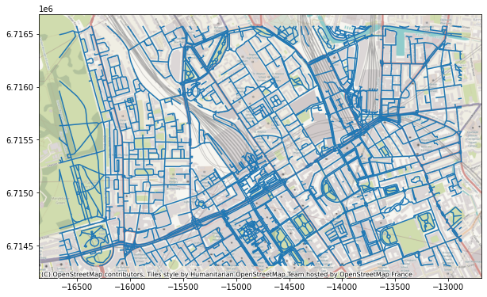
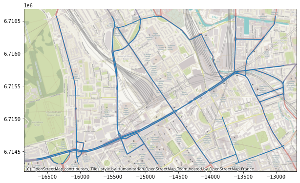
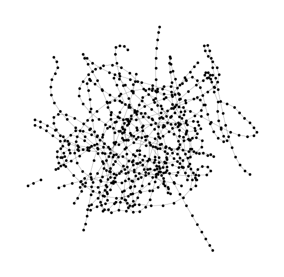
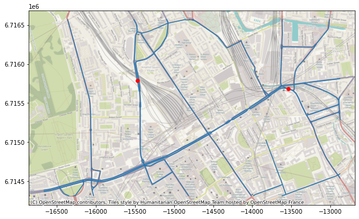
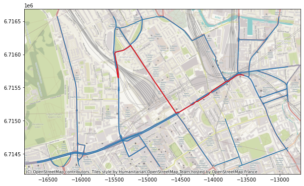
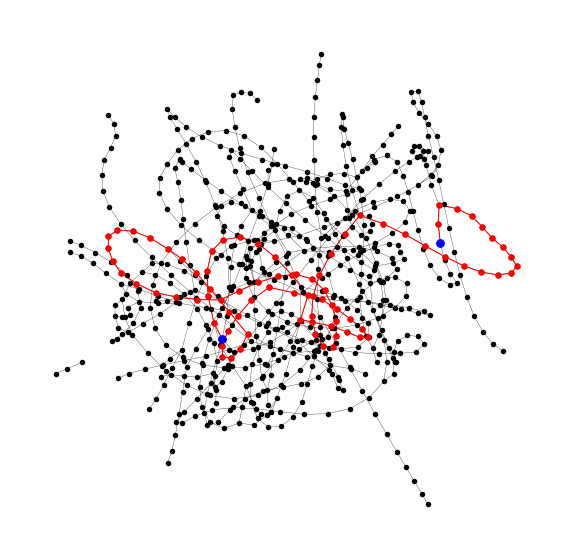
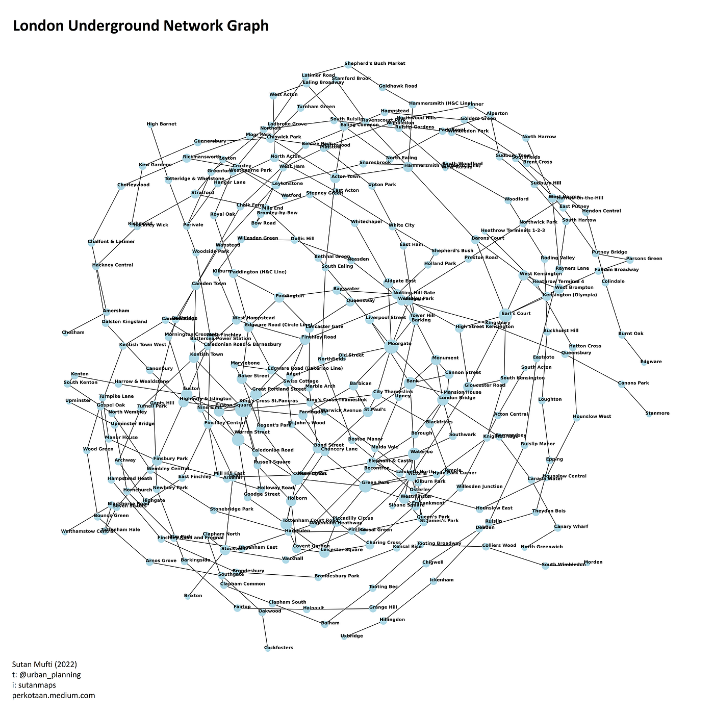

+++
date        = '2022-05-27T18:24:53+07:00'
draft       = false
title       = 'Spatial Data Science: Network Analysis for Transportation Planning'
tags        = ['GIS', 'Python', 'Network Analysis', 'Transportation Planning', 'Graph Theory', 'Networkx', 'Spatial Data Science']
description = 'An introduction to advanced graph theory tools using Python and Networkx for transportation planners, covering shortest path analysis, isochrones, and public transportation network modelling.'
Summary     = 'Graph theory is fundamental to urban transportation analysis. This article introduces Networkx, a Python library for network analysis, and demonstrates shortest path finding, isochrone generation, and public transportation network simulation using real road data.'
featured_image = '1_fnKtyUeCWhqUhYcCShimDQ.jpg'
+++

*Article was published first on [Towards Data Science in 2022](https://medium.com/towards-data-science/spatial-data-science-network-analysis-for-transportation-planning)*.

> **Note:** This article is part of the Spatial Data Science Series by Sutan Mufti. See this [meta-article](https://perkotaan.medium.com/spatial-data-science-the-series-81344a3ead29) for the full series.

## Introduction

Transportation and urban planning practice depends on rigorous network analysis. Questions such as whether a proposed route is feasible, which public transportation configuration is most efficient, how well a region is connected, or whether routes overlap, are all fundamentally questions about graph topology. Graph theory provides the mathematical framework for answering them, and whilst it is domain-agnostic, its application to urban road and transit networks is well established and powerful.

](1_e1gBlZqsSxK5dRzRfGm5Ew.png)

This article introduces a Python-based approach to network analysis for transportation planners. It assumes familiarity with basic graph theory concepts: nodes, edges, and graph structures.

## Why Python

Python is a high-level, interpreted programming language well suited to analytical work that does not require low-level system programming. For transportation analysis, it offers three practical advantages: workflow automation, explicit and reproducible documentation, and a readable syntax that lowers the barrier to entry for non-software engineers. The latter is illustrated by comparing a simple output statement across languages.

In Java:

```java
public class Main {
  public static void main(String[] args) {
    System.out.println("Hello World");
  }
}
```

In Python:

```python
print('hello world')
```

The verbosity difference is significant. For planners whose primary output is analytical insight rather than software systems, Python provides sufficient performance and considerably lower overhead.

## Networkx

[](https://networkx.org/documentation/stable/)

[Networkx](https://networkx.org/documentation/stable/) is a Python library for the creation, manipulation, and analysis of complex networks. It provides a Python interface to algorithms implemented in C++, which delivers competitive performance without requiring low-level programming. The combination of readable syntax and computational efficiency makes it well suited to transportation network analysis at both small and large scales.

> Note: This article uses Python scripting exclusively. Graphical User Interface tools such as QGIS and ArcGIS are not used, in order to prioritise **automation**, **reproducibility**, and **scalability**.

## Data Preparation

The input dataset for this demonstration is an OpenStreetMap (OSM) road network, exported via the [HOT Export Tool](https://export.hotosm.org/en/v3/). The network is loaded and visualised using `geopandas` and `contextily`:

```python
import matplotlib.pyplot as plt;
import contextily as cx;
import geopandas as gpd;

network_gdf = gpd.read_file('osm_network.shp');

fig, ax = plt.subplots(figsize=(10,10));

network_gdf.to_crs('epsg:3857').plot(ax=ax);
cx.add_basemap(ax,
               source=cx.providers.OpenStreetMap.HOT
              );
```

The full road network, including all hierarchy levels, is shown below.



For this analysis, the network is filtered to primary and secondary roads to reduce complexity.



Prior to graph construction, the road data undergoes topology cleaning using GRASS' `v.clean` tool via `pyqgis`. This step resolves common issues such as dangling edges, overshoots, and duplicate geometries, and is essential for producing a topologically valid network. Further guidance is available in [this thread](https://gis.stackexchange.com/questions/279902/unable-to-run-v-clean-in-qgis-3-0-1-in-python-console).

## Graph Model Construction

A shapefile represents geometry, not connectivity. To conduct network analysis, the road data must be converted into a graph model in which intersections become nodes and road segments become edges. Networkx provides the data structure for this representation.

### Identifying Edges

The start and end coordinates of each road segment are extracted to form the edge list. The `pandas` library is used to manage this tabular structure. Each row in the data frame corresponds to one road segment and defines one edge:

```
+----+----------------------+----------------------+
| id |        start         |         stop         |
+----+----------------------+----------------------+
|  0 | (-0.13492, 51.5246)  | (-0.13499, 51.52457) |
|  1 | (-0.11953, 51.52866) | (-0.11956, 51.52871) |
|  2 | (-0.14517, 51.52391) | (-0.14513, 51.52375) |
|  3 | (-0.14423, 51.52399) | (-0.14473, 51.52398) |
|  4 | (-0.14398, 51.52287) | (-0.14415, 51.52325) |
+----+----------------------+----------------------+
note: decimal places reduced for presentation
```

Each row provides two nodes. A `networkx` graph object is constructed by iterating over these rows and adding each pair as a directed or undirected edge. The resulting graph model is shown below.



The graph model encodes the road network's connectivity structure and is now suitable for algorithmic analysis.

## Network Analysis

With the graph model in place, standard graph algorithms can be applied to derive analytical outputs relevant to transportation planning.

### Shortest Path Analysis

Networkx implements Dijkstra's Algorithm for weighted shortest path computation. To demonstrate, the shortest path between coordinates (-0.13894, 51.53115) and (-0.12162, 51.53054) is identified. The origin and destination points are shown below.



The computed shortest path is shown on the map:



The corresponding path within the graph topology is highlighted below.



### Scaling to Large Origin-Destination Datasets

The same shortest path logic scales directly to large datasets. Given an origin-destination matrix with millions of records and an OSM network dataset, iteration over the records using Python loops allows batch computation of shortest paths. Edge weights can be set to represent travel time, distance, or any cost variable, making the approach applicable to a wide range of planning scenarios.

### Isochrone Generation

Networkx also supports isochrone analysis via the `single_source_shortest_path_length` [algorithm](https://networkx.org/documentation/stable/reference/algorithms/generated/networkx.algorithms.shortest_paths.unweighted.single_source_shortest_path_length.html). Given a source node and a maximum path length, the algorithm returns all reachable nodes within that threshold. Applied to a multimodal network combining walking and public transportation, this produces an isochrone showing the area reachable from a given point within a defined time budget.

### Public Transportation Network Simulation

The graph model is equally applicable to transit networks. The graph below represents the London Underground network, constructed from station nodes and line edges.



New routes or services can be added to the graph to simulate how a proposed change would affect overall network connectivity, reachability, or redundancy. This makes the approach a practical tool for rapid appraisal of transit planning scenarios.

## Conclusion

Graph theory provides the formal foundation for urban transportation network analysis, and Networkx provides a practical implementation of that theory in Python. The combination enables transportation planners to conduct reproducible, scalable, and algorithmically rigorous analysis without requiring deep software engineering expertise. The workflow presented here, from raw OSM data to graph construction and shortest path analysis, represents a transferable template applicable to any road or transit network.

The tools involved, Python, Networkx, Geopandas, and GRASS, are all open-source, which lowers barriers to adoption. Analysis developed in this environment is explicit, version-controllable, and readily adapted to new datasets or planning questions.
