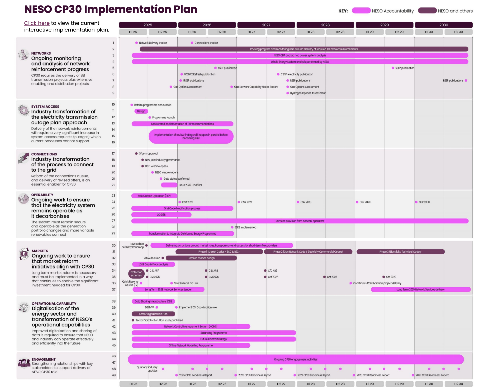
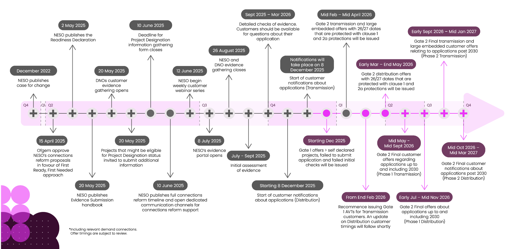
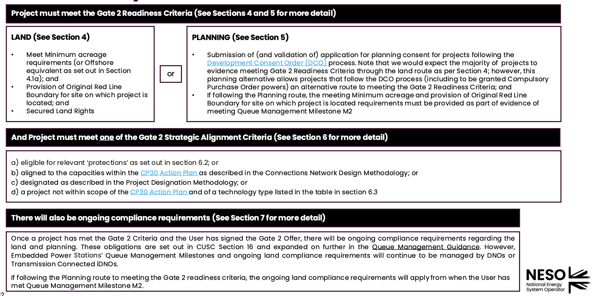
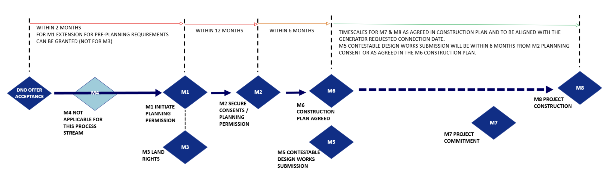
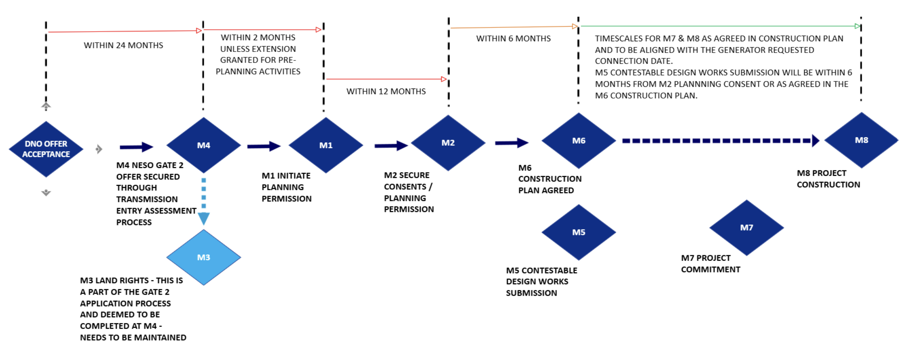
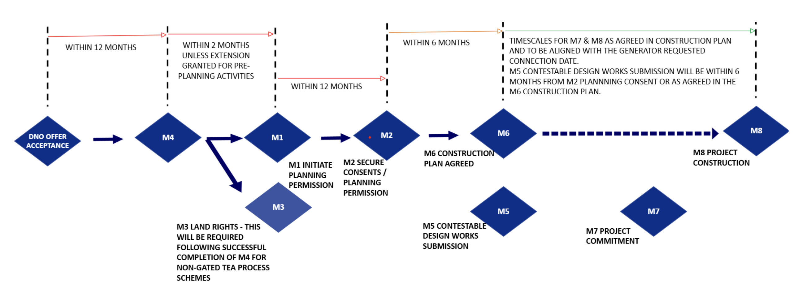

+++
date        = '2026-05-28T14:52:34+07:00'
draft       = false
title       = 'The UK Grid Connection Reform: CMP434 and What It Means for UK Developers'
tags        = ['Development', 'Renewables', 'England', 'United Kingdom', 'Scotland', 'Wales', 'Renewable Energy', 'Solar', 'Wind']
description = 'CMP434 overhauled how renewable projects connect to the UK grid, replacing first-come-first-served with a readiness-based gated process. Here is what changed and what it means for developers.'
Summary     = 'CMP434: Implementing Connections Reform replaced the UK grid connection queue with a gated process built around readiness. This article explains the Gate 1 and Gate 2 structure, how queue management milestones work at both transmission and distribution level, and why planning permission is now the critical first step for any developer.'
featured_image = 'cp2030_neso.png'
pinned = true
+++

# Executive Summary

The UK grid connection queue had broken down. By 2024, thousands of speculative and stalled projects had pushed connection timescales beyond a decade in some areas, making it practically impossible for genuinely ready projects to connect in time to meet the government's Clean Power 2030 target.

[CMP434](https://www.neso.energy/industry-information/codes/cusc/modifications/cmp434-implementing-connections-reform): Implementing Connections Reform, implemented in Q2 2025, is NESO's codified response. It replaces the old first-come-first-served system with a readiness-based gated process. Applications are now accepted only within bi-annual windows. Projects that cannot demonstrate readiness receive a Gate 1 offer: indicative, unconfirmed, with no queue position. Projects that pass the Gate 2 readiness criteria receive a confirmed connection date, confirmed connection point, and trigger binding Queue Management Milestones. [CMP435](https://www.neso.energy/industry-information/codes/cusc/modifications/cmp435-application-gate-2-criteria-existing-contracted-background) applied the same criteria retrospectively to the existing queue.

At transmission level, milestones M1 to M3 (planning, land rights) are conditional: miss one and the project is automatically terminated after a 60-day remedy period. At distribution level, the [ENA Queue Management User Guide v6.0 (September 2025)](https://www.energynetworks.org/publications/updated-queue-management-user-guide) abolished the old tolerance system and replaced it with the same flat 60-day remedy structure, aligned with NESO.

The practical consequence: **planning permission is now the critical first checkpoint**. It is the primary evidence of readiness for Gate 2. The developers who move fastest are those who begin the planning process early, ideally before or in parallel with their connection application.

# Introduction

The UK electricity system is undergoing its most significant structural change in decades. Gas still accounts for roughly a third of generation, but the UK government's [Clean Power 2030 (CP2030)](https://www.neso.energy/publications/clean-power-2030) target demands that the system runs almost entirely on renewable and low-carbon sources within this decade. Delivering that requires connecting an enormous volume of new wind and solar capacity to the grid; faster than the existing process was ever designed to handle.

The policy to accelerate UK decarbonisation stemed on "first-come-first-served" basis. This means whoever applies to connect to the grid first gets the priority to generate revenue. This generated many [zombie projects](https://www.theguardian.com/business/2023/nov/13/ofgem-rules-zombie-projects-grid-wind-solar) as developers apply for as many projects as possible pushing the high quality projects down the queue to connect. 

That process has been the bottleneck. By 2024, the connections queue held thousands of contracted projects and timescales had stretched beyond a decade in some areas, with stalled and speculative applications blocking genuinely ready projects from progressing. The response was a wholesale reform of how the UK manages connections, codified in CMP434: Implementing Connections Reform. This article explains what changed, why it matters, and what it means for developers trying to build renewable projects today.

The Clean Power 2030 timeline is illustrated in the following figure.

# The Connection Reform

The UK's [connection reform](https://www.neso.energy/industry-information/connections-reform/about-connections-reform) addresses a straightforward problem: the existing connections process was built for a simpler energy landscape and cannot cope with the volume and complexity of projects now seeking to connect. By 2024, the queue held thousands of contracted projects, the majority of which were speculative or stalled, blocking capacity from developers who were genuinely ready to build. Connections timescales had stretched to a decade or more in some areas, directly threatening the UK's ability to meet its Clean Power 2030 targets.

The reform is built around a single principle shift: from **first come, first served** to **first ready, first connected**. **CMP434: Implementing Connections Reform** is the code modification that codifies this shift into the Connection and Use of System Code (CUSC). Proposed by NESO and implemented in Q2 2025, CMP434 introduces a new Primary Process for all new connection applications, structured around two formal gates and a bi-annual application window.

## CMP434: Gated Process

**Under CMP434, developers can no longer submit connection applications at any time**. Instead, applications are accepted only within structured windows, opened twice a year. Within each window, a project can apply for either a **Gate 1 offer** or proceed directly to **Gate 2**. Gate 1 is optional and provides an indicative connection date and point - useful for network planning and early visibility, but with no confirmed queue position and no obligation to meet Queue Management Milestones. Gate 2 is the substantive gate: to receive a Gate 2 offer, a project must demonstrate it has met defined readiness criteria. Once accepted, a Gate 2 offer delivers a confirmed connection date, confirmed connection point, confirmed capacity, and triggers the full suite of Queue Management Milestones.

The readiness criteria for Gate 2 are assessed against the Gate 2 Criteria Methodology, which covers two dimensions: project readiness (planning, land rights) and strategic alignment with national energy planning. CMP434 also introduces the concept of a **Red Line Boundary** - the project site boundary submitted at Gate 2 becomes binding, with restrictions on how much installed capacity can be built outside it post-acceptance. This prevents developers from holding a connection position against a speculative site and then building elsewhere.

For existing contracted projects already in the queue, a parallel modification - **CMP435** - applied Gate 2 criteria retrospectively to the whole queue, sorting projects into Gate 1 or Gate 2 status based on their readiness at the time.

## Qualifying the Projects

> The new connection regime rewards shovel-ready projects. Planning permission is no longer just a regulatory formality - it is the primary evidence that a project is real, viable, and ready to build. Securing it early is the single most effective way to accelerate a renewable project through the queue.

The [TM04+](https://www.neso.energy/industry-information/connections/queue-management) queue management policy aims to obliterate the zombie projects filtering the high quality renewable projects out. This is implemented in [CMP 435](https://www.neso.energy/industry-information/codes/cusc/modifications/cmp435-application-gate-2-criteria-existing-contracted-background). In summary, the developers must submit evidence that they demonstrate fulfilling Gate 2 offer criteria which is what developers want. What is a Gate 2 offer? 

> Gate 2 applies to projects that meet the new requirements for readiness and Strategic alignment. These projects can secure a confirmed connection date, connection point, and queue position. ([NESO](https://www.neso.energy/industry-information/connections-reform/about-connections-reform))

## Transmission vs Distribution: Two Separate Processes

Whether a project connects at transmission or distribution level determines both the route of application and the regulatory framework governing queue management. These are entirely separate processes.

**Transmission-connected projects** - typically large-scale generation above 50 MW onshore or 100 MW offshore - apply directly to **NESO**. The legal framework is the Connection and Use of System Code (CUSC), specifically Section 16, updated by CMP376 (November 2023), CMP434, and CMP435. A project only becomes subject to active milestone compliance once it achieves a **Gate 2 Agreement** - Gate 1 contracts include the QM clauses but milestone dates are only populated at Gate 2. The full guidance is published by NESO at [neso.energy/industry-information/connections/queue-management](https://www.neso.energy/industry-information/connections/queue-management).

**Distribution-connected projects** apply to the **relevant Distribution Network Operator (DNO)** - for example, UK Power Networks in the South East or Northern Powergrid in the North East. The framework is the ENA Open Networks Queue Management guidance (December 2020), applied consistently across all DNOs, available at [energynetworks.org/publications/updated-queue-management-user-guide](https://www.energynetworks.org/publications/updated-queue-management-user-guide). Milestones become active upon acceptance of the connection offer; there is no Gate 2 equivalent.

### Queue Management Milestones

Both frameworks share the same milestone structure (M1–M8), but with meaningful differences in application.

For **transmission projects (NESO)**, the eight milestones are:

- **M1 – Initiated Statutory Consents and Planning Permission** *(Conditional Progression Milestone)*: Developer must submit a planning application within a timescale calculated forward from the Gate 2 offer date - 2 years for Town and Country Planning, 3 years for Section 36 or DCO/NSIP, 5 years for offshore. Missing M1 triggers automatic termination.
- **M2 – Secured Statutory Consents and Planning Permission** *(Conditional)*: Full planning permission must be granted. NESO validates against the Local Authority planning portal. Outline permission is not accepted.
- **M3 – Secure Land Rights** *(Conditional)*: Developer must own, lease, or hold an option over the project site. Ongoing compliance is measured against the Original Red Line Boundary - no more than 50% of installed capacity can sit outside it without exception.
- **M4 – N/A**: Does not apply for transmission-connected projects.
- **M5 – Contestable Design Works Submission** *(Construction Progression Milestone)*: Applies only where the developer has taken the contestable route; written confirmation from the Relevant Transmission Licensee is required.
- **M6 – Agree Construction Plan** *(Construction)*: A detailed programme for the User's Works, agreed with NESO, showing how the project achieves the contracted Completion Date.
- **M7 – Project Commitment** *(Construction)*: Evidence of financial commitment - a binding equipment contract, capital contribution to NESO, board-approved Final Investment Decision, or a subsidy award such as a Contracts for Difference.
- **M8 – Initiate Construction** *(Construction)*: A board-level letter confirming construction has commenced, supported by site photos or contractor invoices.

Milestones M1–M3 are **Conditional Progression Milestones**: failure triggers automatic termination after a 60-day remedy period. Milestones M5–M8 are **Construction Progression Milestones**: NESO has discretion over whether to terminate.

For **distribution projects (DNO)**, the current framework is the ENA Queue Management User Guide v6.0 (September 2025), a significant revision driven by the Ofgem/DESNZ Connections Action Plan. The most important change from earlier versions: the old tolerance and cumulative delay system has been **abolished**, replaced by a flat **60-day Milestone Remedy Notice Period** for all milestones - directly aligned with the NESO approach.

The milestone structure now branches into three process streams depending on whether the project requires a [Transmission Entry Assessment (TEA)](https://www.ofgem.gov.uk/sites/default/files/2025-05/CMP446%20-%20Authority%20decision%20to%20approve%20WACM%201.pdf):

**Stream 1 - No TEA required** (generally below 5 MW in England and Wales):
- M4 does not apply.
- **M1**: Submit planning application within 2 months of offer acceptance. Extendable if the Planning Authority imposes pre-planning requirements (EIA, ecological surveys, Landscape and Visual Impact Assessments) - typically extended by 12 months.
- **M2**: Secure planning permission within 12 months of M1.
- **M3**: Confirm land rights within 2 months of offer acceptance.
- **M6**: Agree Construction Plan with the DNO within 6 months of M2.
- **M5, M7, M8**: Timescales agreed within the M6 Construction Plan.

**Stream 2 - TEA Gated process** (generation ≥5 MW in England and Wales, ≥200 kVA in Scotland, subject to NESO Gate 2):
- **M4**: Customer must complete the NESO TEA Gated process and accept the revised DNO Gate 2 connection offer within **24 months** of accepting the original DNO offer. This is the first and critical milestone.
- **M3**: Deemed met via the Gated process (Land Readiness route) - no separate evidence required unless a DCO process applies.
- **M1, M2, M6**: Calculated from M4 completion. M1 within 2 months of M4, M2 within 12 months of M1, M6 within 6 months of M2.

**Stream 3 - TEA non-Gated process** (projects requiring NESO assessment but not subject to Gate 2 - typically larger demand connections):
- **M4**: Customer must meet NESO Modification Conditions within **12 months** of offer acceptance.
- **M1, M2, M3, M6**: Calculated from M4 completion. M1 within 2 months of M4, M2 within 12 months of M1, M3 within 2 months of M4, M6 within 6 months of M2.

For all three streams, where the offered connection date is **more than 5 years** from offer acceptance, milestone dates are calculated backwards from the connection date rather than forwards - mirroring the NESO approach.

Non-compliance in all streams triggers the same process: a Milestone Remedy Period Notice gives the customer 60 calendar days to provide evidence. For Pre-Construction Milestones (M1–M4 and M6), failure at the end of that period leads to termination notice. For Construction Milestones (M5, M7, M8), the DNO has discretion to terminate or agree revised dates.

The practical implication is that the distribution framework now behaves much more like the NESO framework than it did before 2025. Each milestone is a hard deadline with a fixed remedy window - there is no longer a tolerance buffer that absorbs cumulative slippage across multiple milestones.

# Closing

CMP434 represents a structural reset of how the UK connects generation to the grid. The rules have changed, and for developers, the consequences of misunderstanding them are serious. A project that misses a Conditional Progression Milestone does not get a second chance through accumulated tolerance; it gets a termination notice.

The shift to a readiness-based system is ultimately good news for developers who are genuinely ready to build. The queue is being cleared of projects that were never going to connect. Connection timescales should compress as stalled capacity is released. But that benefit only materialises for developers who understand the new process and plan accordingly.

The single most important practical implication is the role of planning permission. Under the old system, a developer could secure a connection position and pursue planning later. Under CMP434, planning is the primary evidence of Gate 2 readiness. Any project that lacks planning consent, or a credible path to it within the M1 timescale, cannot hold a confirmed connection position. The planning process and the connection process must run in parallel, not sequentially.

For developers working at distribution level, the same logic applies. The abolition of the tolerance buffer in ENA v6.0 means the 2-month M1 deadline after offer acceptance is a hard constraint, not a soft target. Pre-planning work (ecological surveys, environmental assessments, stakeholder engagement) must begin before the connection offer is signed, not after. Waiting until after acceptance is no longer a viable strategy.

The reform is still new and its full effects on connection timescales will take time to become clear. But the framework is in place. The queue is being reshaped. And the developers who thrive in it will be those who treated planning as the starting gun, not the finish line.
